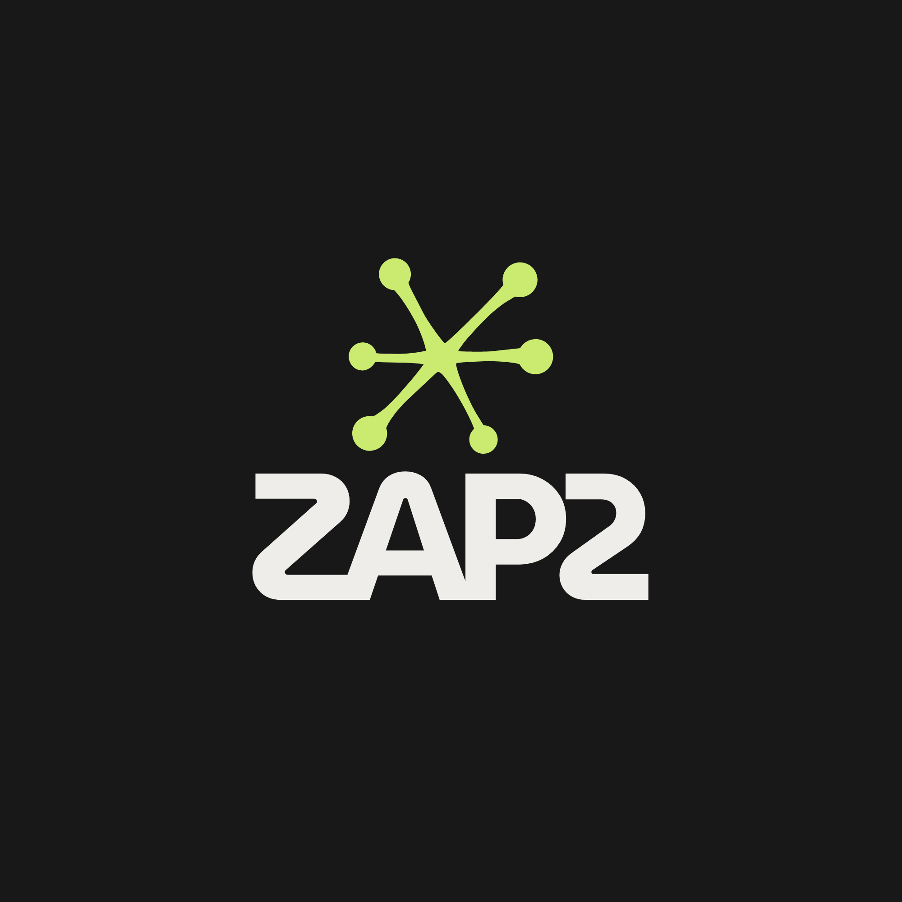
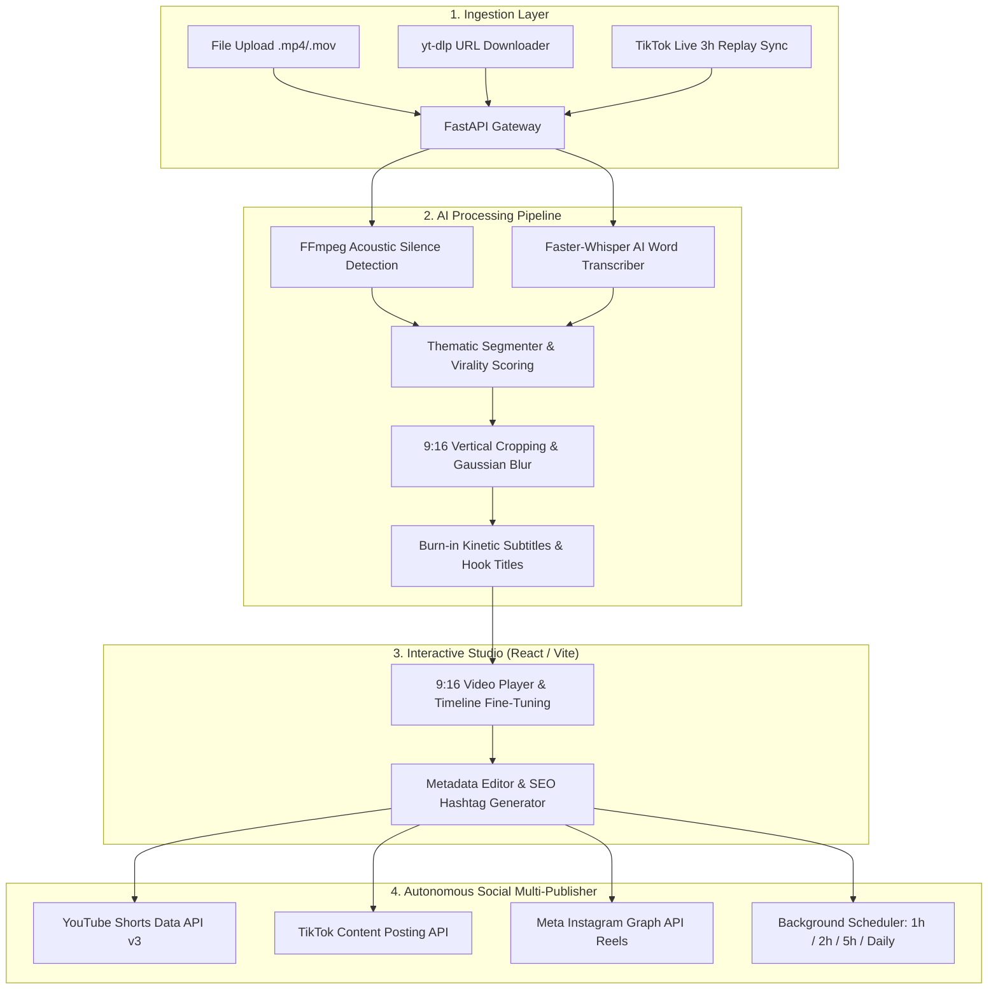

<p align="center">
  
</p>

<h1 align="center">⚡ ZAP2 — AI Video Repurposing & Multi-Posting Studio 🎬</h1>

<p align="center">
  <strong>Transform raw video streams & long-form recordings into viral 9:16 Shorts & Reels with intelligent silence excision, kinetic subtitles, hook titles, and autonomous multi-platform publishing.</strong>
</p>

<p align="center">
  <a href="https://github.com/kalifa4y/Zap2/actions/workflows/ci.yml"></a>
  
  
  
  
  
  
  
  <a href="LICENSE"></a>
</p>

---

## 📖 Table of Contents

- [✨ Key Features](#-key-features)
- [🏗️ System Architecture](#️-system-architecture)
- [⚡ Quick Start Guide](#-quick-start-guide)
  - [Prerequisites](#prerequisites)
  - [1. Backend Setup](#1-backend-setup)
  - [2. Frontend Setup](#2-frontend-setup)
  - [3. One-Click Launcher](#3-one-click-launcher)
- [🎯 The 9:16 Kinetic Subtitles & Hooks Engine](#-the-916-kinetic-subtitles--hooks-engine)
- [🔴 TikTok Live & Online URL Sync](#-tiktok-live--online-url-sync)
- [🚀 Multi-Platform Publishing & Scheduling](#-multi-platform-publishing--scheduling)
- [⚙️ Configuration & Environment Variables](#️-configuration--environment-variables)
- [📁 Directory Structure](#-directory-structure)
- [🧪 Running Tests](#-running-tests)
- [🤝 Contributing](#-contributing)
- [📄 License](#-license)

---

## ✨ Key Features

* 🧠 **Smart Acoustic Silence Excision:** Automatically detects dead air, awkward pauses, and hesitations (*"um/uh"*) using FFmpeg `silencedetect` and AI word-level alignment.
* 📐 **Intelligent 9:16 Vertical Framing:** Centers subjects dynamically and generates aesthetically pleasing Gaussian background blurs (`boxblur`) for widescreen footage.
* 🎨 **Kinetic Subtitles & Animated Hooks:** Burns dynamic word-by-word karaoke captions and bounce-animated hook titles directly into video frames.
* 📥 **Universal URL Downloader (`yt-dlp`):** Instantly downloads full stream recordings from YouTube, Twitch, TikTok, or direct MP4 links.
* 🔴 **TikTok Live Studio Auto-Sync:** Monitors stream end times and automatically schedules replay downloads 3 hours post-broadcast.
* 🚀 **Autonomous Multi-Platform Publishing:** Direct OAuth2 posting and frequency-based scheduling (every 1h, 2h, 5h, 1x/day, 3x/day) to **YouTube Shorts**, **TikTok**, and **Instagram Reels**.
* ⚡ **Ultra-Fast Local Processing:** Powered by `faster-whisper` (CTranslate2) with GPU acceleration and automatic CPU `int8` fallback.

---

## 🏗️ System Architecture



---

## ⚡ Quick Start Guide

### Prerequisites

1. **Python 3.11+** installed on your system.
2. **Node.js 18+** and `npm`.
3. **FFmpeg 6.0+** installed and available in your system `PATH`.
   - *Windows (Chocolatey/Scoop):* `choco install ffmpeg` or `scoop install ffmpeg`
   - *macOS (Homebrew):* `brew install ffmpeg`
   - *Ubuntu/Debian:* `sudo apt update && sudo apt install -y ffmpeg`

---

### 1. Backend Setup

```bash
cd backend

# Create and activate virtual environment
python -m venv venv

# On Windows:
.\venv\Scripts\activate
# On Linux / macOS:
source venv/bin/activate

# Install dependencies
pip install -r requirements.txt

# Create environment configuration
cp .env.example .env

# Start FastAPI server
uvicorn app.main:app --reload --port 8000
```
> 📚 **API Documentation:** Interactive Swagger UI available at `http://localhost:8000/docs`.

---

### 2. Frontend Setup

```bash
cd frontend

# Install Node dependencies
npm install

# Start Vite development server
npm run dev
```
> 🖥️ **Studio UI:** Open your browser at `http://localhost:5173`.

---

### 3. One-Click Launcher

For instant launch on Windows or Unix systems:

* **Windows:** Double-click [`run_app.bat`](run_app.bat)
* **Linux / macOS:**
  ```bash
  chmod +x run_app.sh
  ./run_app.sh
  ```

---

## 🎯 The 9:16 Kinetic Subtitles & Hooks Engine

ZAP2 provides 4 professionally curated subtitle & hook presets:

| Style Preset | Visual Description | Best Suited For |
| :--- | :--- | :--- |
| **🔥 MrBeast Pop** | High-energy Electric Lime (`#bbf246`) & White pop shadows | Gaming, loud reactions, high-octane clips |
| **⚡ Cyber Glow** | Neon Chartreuse glow with deep studio charcoal backdrop | Tech talks, podcasts, crypto, futurism |
| **✨ TikTok Modern** | Clean minimalist white typography with frosted dark container | Storytelling, tutorials, lifestyle vlogs |
| **💡 Gold Energy** | Vibrant yellow-gold drop-shadows with uppercase kinetic impact | Motivation, business, highlights |

---

## 🔴 TikTok Live & Online URL Sync

1. **TikTok Live Studio Sync:** Enter your `@username` and select the post-live delay (e.g. 3 hours). ZAP2 periodically checks for completed broadcasts, retrieves high-definition recordings, and prepares them for clipping.
2. **URL Download Engine:** Paste any public link from YouTube, Twitch, TikTok, or direct MP4 streams. `yt-dlp` extracts the best video stream automatically.

---

## 🚀 Multi-Platform Publishing & Scheduling

ZAP2 integrates official OAuth2 authentication and automated publishing pipelines:

* **YouTube Shorts:** Publishes via `YouTube Data API v3` with auto `#Shorts` category tags.
* **TikTok:** Publishes via `TikTok Content Posting API` with direct upload tokens.
* **Instagram Reels:** Publishes via `Meta Instagram Graph API` (`/media` + `/media_publish` container flow).
* **Autonomous Scheduling Bot:** Set publishing intervals (**Every 1h, 2h, 5h, Once a day, 3x a day**) to automatically distribute your content queue over time.

---

## ⚙️ Configuration & Environment Variables

Configure your credentials in `backend/.env`:

| Variable | Default Value | Description |
| :--- | :--- | :--- |
| `API_V1_STR` | `/api/v1` | API Route Prefix |
| `DATABASE_URL` | `sqlite:///./snapcut.db` | SQLAlchemy Database Connection URL |
| `WHISPER_MODEL` | `base` | Model size (`tiny`, `base`, `small`, `medium`, `large-v3`) |
| `GOOGLE_CLIENT_ID` | *optional* | Google Cloud OAuth2 Client ID for YouTube |
| `GOOGLE_CLIENT_SECRET` | *optional* | Google Cloud OAuth2 Client Secret |
| `TIKTOK_CLIENT_KEY` | *optional* | TikTok for Developers Client Key |
| `TIKTOK_CLIENT_SECRET`| *optional* | TikTok for Developers Client Secret |
| `INSTAGRAM_CLIENT_ID` | *optional* | Meta Developers App ID for Instagram |
| `INSTAGRAM_CLIENT_SECRET`| *optional* | Meta Developers App Secret |

> 💡 *Note: If API credentials are not provided, ZAP2 seamlessly operates in local simulation mode for instant prototyping.*

---

## 📁 Directory Structure

```text
Zap2/
├── .github/
│   └── workflows/
│       └── ci.yml                 # Automated CI (Pytest & Vite Build)
├── backend/
│   ├── app/
│   │   ├── api/v1/endpoints/      # videos.py, cut.py, social.py, auth.py
│   │   ├── core/                  # config.py, database.py
│   │   ├── models/                # project.py, clip.py, social.py
│   │   ├── schemas/               # pydantic schemas
│   │   ├── services/
│   │   │   ├── video_downloader.py # yt-dlp URL video downloader
│   │   │   ├── video_processor.py  # FFmpeg silencedetect, 9:16 crop & burn-in
│   │   │   ├── speech_analyzer.py  # faster-whisper transcription & keywords
│   │   │   └── social_publisher.py # YouTube, TikTok & Instagram Reels
│   │   └── main.py                # FastAPI Application Entrypoint
│   ├── tests/                     # 16+ Unit and Integration Pytest tests
│   └── requirements.txt           # Python backend dependencies
├── frontend/
│   ├── src/
│   │   ├── assets/                # logo.png and graphics
│   │   ├── components/
│   │   │   ├── dashboard/         # VideoUploader, TikTokLiveSync, Progress
│   │   │   ├── studio/            # VideoPlayer 9:16, ClipCard, TimelineAdjuster
│   │   │   ├── social/            # SocialAccounts, ScheduleCalendar, PublishModal
│   │   │   └── layout/            # Header, TabNav
│   │   ├── services/              # api.ts (REST client)
│   │   ├── stores/                # useStudioStore.ts (Zustand state)
│   │   └── App.tsx
│   ├── tailwind.config.js         # Zap2 Electric Lime Design System
│   └── vite.config.ts
├── docs/                          # Comprehensive lifecycle & user guides
├── logo.png                       # Official ZAP2 Brand Logo
├── run_app.bat                    # Windows One-Click Starter
├── run_app.sh                     # Unix One-Click Starter
├── CONTRIBUTING.md                # Contribution Guidelines
├── LICENSE                        # MIT License
└── README.md
```

---

## 🧪 Running Tests

### Backend Test Suite (Pytest)
```bash
cd backend
pytest -v
```

### Frontend Typecheck & Production Build
```bash
cd frontend
npm run build
```

---

## 🤝 Contributing

Contributions, issues, and feature requests are welcome!
Please check the [Contributing Guidelines](CONTRIBUTING.md) before getting started.

---

## 📄 License

This project is licensed under the **MIT License** — see the [LICENSE](LICENSE) file for details.

<p align="center">
  Made with ⚡ by <a href="https://github.com/kalifa4y">Kalifa</a> and the ZAP2 Community.
</p>
