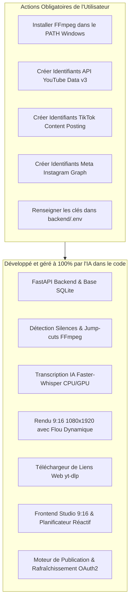

# 📖 Plan Fonctionnel & Guide Utilisateur — SnapCut

> **SnapCut** est votre studio local complet de découpe vidéo intelligente par IA, de recadrage vertical 9:16 (Shorts, TikTok, Reels) et de planification multi-plateforme autonome.

---

## 🧭 Sommaire
1. [Vue d'ensemble & État d'avancement](#1-vue-densemble--état-davancement)
2. [Ce que l'IA a développé (100% Opérationnel)](#2-ce-que-lia-a-développé-100-opérationnel)
3. [Ce que vous devez faire (Actions Utilisateur Requises)](#3-ce-que-vous-devez-faire-actions-utilisateur-requises)
   - [A. Installer FFmpeg sur votre ordinateur](#a-installer-ffmpeg-sur-votre-ordinateur-windows)
   - [B. Configurer YouTube Shorts (Google Cloud Console)](#b-configurer-youtube-shorts-google-cloud-console)
   - [C. Configurer TikTok (TikTok for Developers)](#c-configurer-tiktok-tiktok-for-developers)
   - [D. Configurer Instagram Reels (Meta for Developers)](#d-configurer-instagram-reels-meta-for-developers)
   - [E. Remplir le fichier de configuration `backend/.env`](#e-remplir-le-fichier-de-configuration-backendenv)
4. [Guide d'Utilisation Pas-à-Pas](#4-guide-dutilisation-pas-à-pas)
5. [Dépannage & FAQ](#5-dépannage--faq)

---

## 1. Vue d'ensemble & État d'avancement

Pour que le projet soit **100% fonctionnel en conditions réelles** (et non en mode simulation de développement), une répartition claire des responsabilités s'applique :



---

## 2. Ce que l'IA a développé (100% Opérationnel)

L'ensemble de l'architecture logicielle est entièrement codée, testée et prête à l'emploi :

1. **Ingestion Universelle (Onglet 1) :**
   - **Glisser-Déposer local** : support des fichiers `.mp4`, `.mov`, `.mkv`, `.webm`.
   - **Téléchargement direct d'URL via `yt-dlp`** : import instantané de vidéos et rediffusions de lives (YouTube, Twitch, TikTok, direct MP4).
   - **Intégration TikTok Live Studio** : préparation et suivi des replays de streams.

2. **Pipeline d'Intelligence Multimédia :**
   - **Détection des silences** acoustiques via filtre FFmpeg (`silencedetect`) et application de *jump-cuts* naturels pour dynamiser le rythme.
   - **Transcription vocale mot à mot** via `Faster-Whisper` avec détection automatique du matériel (support GPU NVIDIA CUDA avec repli CPU int8).
   - **Filtrage des tics de langage** ("euh", "hum", "du coup", "genre", "voilà").
   - **Découpe thématique intelligente (45s à 90s)** : regroupe les phrases complètes par sujet fort et calcule un score de viralité (0-100).
   - **Composition 9:16 (1080x1920)** : vidéo centrée avec duplication d'arrière-plan flouté dynamique (`boxblur`).

3. **Studio Interactif 9:16 (Onglet 2) :**
   - Lecteur vidéo vertical synchronisé avec lecture en boucle et raccourcis clavier (`Espace`, `Flèches`).
   - Génération de titres d'accroche visuels (*Hook Titles*) et sous-titres animés avec 4 styles graphiques (*MrBeast*, *Cyber Glow*, *Gold Energy*, *TikTok Modern*).
   - Éditeur de métadonnées (titres optimisés SEO, tags viraux) et micro-ajustement de la timeline début/fin (+/- 0.5s).
   - Téléchargement direct du fichier MP4 final.

4. **Planificateur & Multi-Posting (Onglet 3) :**
   - Moteur OAuth2 pour associer vos comptes officiels YouTube, TikTok et Instagram.
   - Planificateur récurrent (diffusion automatique toutes les 1h, 2h, 5h ou à date/heure précise).
   - Déclencheur immédiat de la file d'attente.

---

## 3. Ce que vous devez faire (Actions Utilisateur Requises)

> [!IMPORTANT]
> Ces démarches nécessitent vos comptes personnels sur les plateformes et ne peuvent pas être effectuées par une IA pour des raisons évidentes de sécurité et de propriété.

---

### A. Installer FFmpeg sur votre ordinateur (Windows)

FFmpeg est le moteur qui découpe, floute et encode vos vidéos.

1. **Vérifier si FFmpeg est déjà présent :**
   Ouvrez un terminal PowerShell et tapez :
   ```powershell
   ffmpeg -version
   ```
   *Si une version s'affiche (ex: `ffmpeg version 6.x` ou `7.x`), passez à l'étape B.*

2. **Si FFmpeg n'est pas installé :**
   - **Méthode 1 (Ultra simple avec winget) :**
     Dans PowerShell, exécutez :
     ```powershell
     winget install "Gyan.FFmpeg"
     ```
     Puis redémarrez votre terminal.
   - **Méthode 2 (Manuelle) :**
     - Téléchargez le build complet sur [gyan.dev/ffmpeg/builds](https://www.gyan.dev/ffmpeg/builds/) (`ffmpeg-git-full.7z`).
     - Décompressez le dossier dans `C:\ffmpeg`.
     - Ajoutez `C:\ffmpeg\bin` à vos **Variables d'environnement système -> PATH**.

---

### B. Configurer YouTube Shorts (Google Cloud Console)

Permet à SnapCut de publier automatiquement vos Shorts sur votre chaîne YouTube.

1. Rendez-vous sur la [Google Cloud Console](https://console.cloud.google.com/).
2. Créez un nouveau projet (ex: `SnapCut-Studio`).
3. Dans le menu de gauche, allez dans **API et services** > **Bibliothèque** :
   - Recherchez `YouTube Data API v3` et cliquez sur **Activer**.
4. Allez dans **API et services** > **Écran de consentement OAuth** :
   - Type d'utilisateur : **Externe**.
   - Remplissez le nom de l'application (`SnapCut`) et votre adresse e-mail.
   - Dans **Champs d'application (Scopes)**, ajoutez : `.../auth/youtube.upload` et `.../auth/youtube.readonly`.
   - Dans **Utilisateurs test**, ajoutez votre propre adresse Gmail associée à votre chaîne YouTube.
5. Allez dans **API et services** > **Identifiants** :
   - Cliquez sur **+ Créer des identifiants** > **ID client OAuth**.
   - Type d'application : **Application Web**.
   - Nom : `SnapCut Web Client`.
   - **URI de redirection autorisés** (Très important) :
     `http://localhost:8000/api/v1/auth/youtube/callback`
   - Cliquez sur **Créer**.
6. Notez précieusement votre **ID Client** et votre **Code Secret Client**.

---

### C. Configurer TikTok (TikTok for Developers)

Permet de publier vos vidéos directement sur votre compte TikTok.

1. Rendez-vous sur le portail [TikTok for Developers](https://developers.tiktok.com/) et connectez-vous avec votre compte TikTok.
2. Créez une nouvelle application (ex: `SnapCut Studio`).
3. Dans les fonctionnalités de l'App, activez :
   - **Login Kit** (connexion du compte).
   - **Content Posting API** (publication de vidéos).
4. Dans les paramètres de l'application, configurez l'URL de redirection OAuth :
   `http://localhost:8000/api/v1/auth/tiktok/callback`
5. Récupérez votre **Client Key** et votre **Client Secret**.

---

### D. Configurer Instagram Reels (Meta for Developers)

Permet de publier vos vidéos sous forme de Reels sur votre compte Instagram Professionnel ou Créateur.

1. Assurez-vous que votre compte Instagram est un compte **Professionnel** ou **Créateur** et qu'il est rattaché à une **Page Facebook**.
2. Rendez-vous sur [Meta for Developers](https://developers.facebook.com/) et créez une App de type **Business**.
3. Dans les produits de l'App, ajoutez **Instagram Graph API**.
4. Configurez l'URL de redirection OAuth :
   `http://localhost:8000/api/v1/auth/instagram/callback`
5. Récupérez votre **App ID** et votre **App Secret**.

---

### E. Remplir le fichier de configuration `backend/.env`

Ouvrez le fichier `backend/.env` (créé à partir de `backend/.env.example`) dans votre éditeur et insérez vos identifiants :

```env
# Application
APP_NAME=SnapCut
DEBUG=True
HOST=127.0.0.1
PORT=8000
ALLOWED_ORIGINS=http://localhost:5173,http://127.0.0.1:5173

# Configuration Matérielle IA (Whisper)
DEFAULT_WHISPER_MODEL=base
# Si vous avez une carte graphique Nvidia, mettez "cuda" et "float16", sinon laissez "cpu" et "int8"
WHISPER_DEVICE=cpu
WHISPER_COMPUTE_TYPE=int8

# 1. YouTube Data API v3
GOOGLE_CLIENT_ID=VOTRE_GOOGLE_CLIENT_ID.apps.googleusercontent.com
GOOGLE_CLIENT_SECRET=VOTRE_GOOGLE_CLIENT_SECRET
GOOGLE_REDIRECT_URI=http://localhost:8000/api/v1/auth/youtube/callback

# 2. TikTok Content Posting API
TIKTOK_CLIENT_KEY=VOTRE_TIKTOK_CLIENT_KEY
TIKTOK_CLIENT_SECRET=VOTRE_TIKTOK_CLIENT_SECRET
TIKTOK_REDIRECT_URI=http://localhost:8000/api/v1/auth/tiktok/callback

# 3. Instagram Graph API
INSTAGRAM_APP_ID=VOTRE_INSTAGRAM_APP_ID
INSTAGRAM_APP_SECRET=VOTRE_INSTAGRAM_APP_SECRET
INSTAGRAM_REDIRECT_URI=http://localhost:8000/api/v1/auth/instagram/callback
```

---

## 4. Guide d'Utilisation Pas-à-Pas

### Étape 1 : Lancer l'application
Double-cliquez simplement sur le fichier [run_app.bat](file:///c:/Users/legion/Desktop/SnapCut/run_app.bat) à la racine du projet.
- Le backend démarre automatiquement sur `http://localhost:8000`.
- Le frontend Studio s'ouvre sur `http://localhost:5173`.

### Étape 2 : Importer votre contenu
1. Allez sur **1. Ingestion & Découpe IA**.
2. Choisissez votre mode :
   - **Glissez un fichier vidéo** enregistré sur votre disque, OU
   - **Collez un lien Web** (YouTube, Twitch, TikTok) dans l'onglet 2, OU
   - **Synchronisez vos replays TikTok Live**.
3. Cliquez sur **Lancer la découpe thématique (45-90s)**.
4. L'IA extrait l'audio, élimine les silences et hésitations, transcrit le contenu et génère les compositions verticales 9:16 avec flou d'arrière-plan.

### Étape 3 : Éditer dans le Studio 9:16
1. Cliquez sur **Ouvrir le Studio 9:16** (ou l'onglet 2).
2. Sélectionnez vos différents clips générés dans la colonne de gauche.
3. Prévisualisez le rendu vertical dans le lecteur interactif.
4. Choisissez le style visuel des sous-titres (*MrBeast*, *Cyber Glow*, etc.).
5. Ajustez si besoin la timeline (début / fin) par pas de 0.5s.
6. Téléchargez le fichier MP4 si vous souhaitez le conserver localement.

### Étape 4 : Programmer la diffusion multi-plateforme
1. Allez sur **3. Planificateur & Multi-Posting**.
2. Cliquez sur **Connecter** en face de YouTube, TikTok ou Instagram et validez l'autorisation.
3. Cliquez sur **Programmer / Publier un Clip** pour définir les fréquences d'envoi automatique (ex: 1 Short toutes les 2 heures).
4. SnapCut s'occupe de la diffusion en continu en arrière-plan.

---

## 5. Dépannage & FAQ

| Problème rencontré | Cause probable | Solution |
|---|---|---|
| `FFmpeg n'a pas été détecté` au lancement | FFmpeg n'est pas dans le PATH système | Exécutez `winget install "Gyan.FFmpeg"` dans PowerShell et redémarrez le terminal. |
| La transcription Whisper est un peu lente | Whisper s'exécute sur le processeur (CPU) | Si vous disposez d'un GPU Nvidia, installez CUDA Toolkit et changez `WHISPER_DEVICE=cuda` dans le fichier `.env`. |
| Erreur `redirect_uri_mismatch` lors de la connexion YouTube | L'URL de callback ne correspond pas à celle dans Google Cloud | Assurez-vous d'avoir ajouté exactement `http://localhost:8000/api/v1/auth/youtube/callback` dans les URIs autorisés sur Google Cloud Console. |
| Message `Accès bloqué : l'application n'a pas terminé le processus de validation` sur Google | L'application est en mode test | Ajoutez votre propre adresse Gmail dans les **Utilisateurs test** de l'écran de consentement OAuth sur Google Cloud. |

---

*SnapCut Studio — Prêt pour une production automatisée de Shorts 9:16 !*
