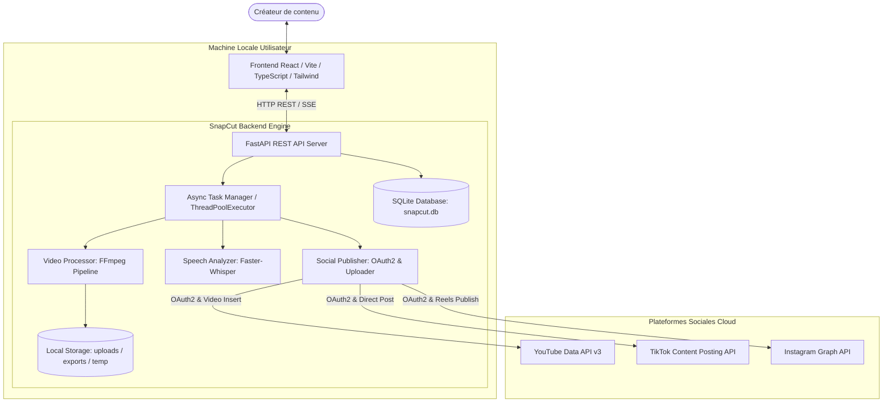
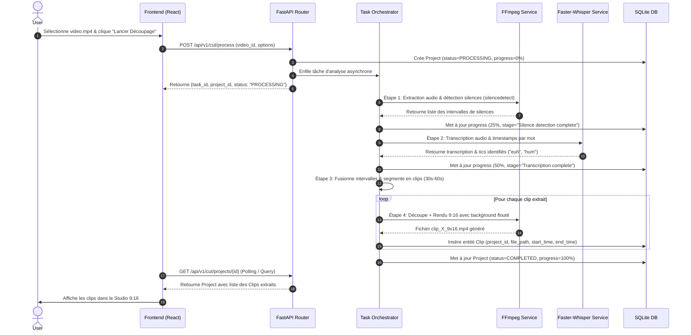

# System Architecture — SnapCut

## 1. Architecture Overview
**SnapCut** est structuré comme une application hybride locale à couplage lâche, composée d'une **Single Page Application (SPA) réactive** en frontend et d'un **Serveur d'API & Moteur Multimédia Local** en backend.

---

## 2. Architectural Drivers & Principles
1. **Zéro friction & Exécution 100% Locale :** L'ingestion, la transcription IA et le ré-encodage vidéo s'exécutent entièrement sur la machine de l'utilisateur sans dépendance cloud payante ni transfert de vidéos brutes vers un serveur tiers.
2. **Asynchronisme Non-Bloquant :** Les opérations de traitement vidéo (FFmpeg) et de transcription IA (Whisper) étant intensives en CPU/GPU, elles s'exécutent dans des threads dédiés (`ThreadPoolExecutor`) coordonnés par `asyncio`, permettant à l'API de répondre immédiatement aux requêtes d'état et à l'UI de rester à 60 FPS.
3. **Séparation Nette des Responsabilités :**
   - *VideoProcessor :* Métadonnées, filtres FFmpeg (`silencedetect`, composition 9:16 avec arrière-plan flou).
   - *SpeechAnalyzer :* Extraction audio WAV 16kHz, inférence Faster-Whisper, horodatage au mot, filtrage des hésitations verbales.
   - *SocialPublisher :* Gestion des tokens OAuth2 (YouTube, TikTok, Instagram) et protocoles d'upload résumables.

---

## 3. Major Components & Responsibilities

### 3.1. Frontend SPA (Client Layer)
* **Dashboard & Ingestion :** Zone de glisser-déposer de fichiers vidéo locaux avec sélecteurs de seuils acoustiques (dB, durée de silence) et choix du modèle Whisper.
* **Studio Player 9:16 :** Lecteur vidéo HTML5 interactif dédié au format vertical (1080x1920), avec contrôles de lecture, boucle, et timecodes.
* **Éditeur de Métadonnées & Ajusteur Temporel :** Formulaire réactif pour modifier le titre, la description, les hashtags et ajuster les bornes temporelles de début/fin du clip.
* **Panneau Social & Gestionnaire OAuth2 :** Visualisation des comptes connectés (YouTube, TikTok, Instagram) et déclencheur d'upload multi-plateforme avec barre de progression.

### 3.2. Backend API (FastAPI)
* **Endpoints REST `/api/v1/videos` :** Upload/sélection de fichier vidéo brut, extraction des métadonnées, streaming de fichiers vidéo locaux.
* **Endpoints REST `/api/v1/cut` :** Déclenchement du pipeline d'analyse et de découpe, consultation du statut de traitement (`status`, `progress`, `stage`), mise à jour et ré-encodage d'un clip.
* **Endpoints REST `/api/v1/auth` & `/api/v1/social` :** URLs d'autorisation OAuth2, callbacks pour YouTube, TikTok et Instagram, statut des comptes connectés, déclenchement d'upload.

### 3.3. Processing Pipeline (Multimédia & IA)

---

## 4. Security & Data Persistence Boundaries
* **Base locale `snapcut.db` :** Contient la table `SocialAccount` stockant `access_token`, `refresh_token`, et date d'expiration.
* **Stockage média :**
  - `storage/uploads/` : Fichiers sources importés.
  - `storage/exports/` : Shorts 9:16 exportés.
  - `storage/temp/` : Pistes audio temporaires `.wav` nettoyées après transcription.
* **Gestion des Secrets OAuth2 :** Les variables d'environnement (`GOOGLE_CLIENT_ID`, `GOOGLE_CLIENT_SECRET`, `TIKTOK_CLIENT_KEY`, `INSTAGRAM_APP_ID`, etc.) sont injectées via le fichier `.env` local.

---

## 5. Architectural Status
* **Status :** PASS (Coherent & Verified)
* **Next Phase :** 07 — database-design
