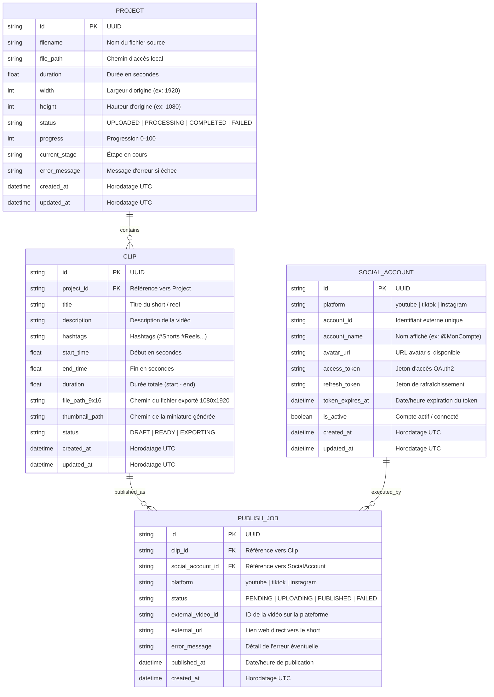

# Database Design — SnapCut

## 1. Database Overview
* **Moteur :** SQLite 3 (fichier local `snapcut.db`).
* **ORM & Toolkit :** SQLAlchemy 2.0 avec Pydantic v2 pour la validation et sérialisation.
* **Objectif :** Persistance locale robuste des métadonnées de projets vidéo, des clips générés, des tokens OAuth2 et de l'historique de publication.

---

## 2. Entity-Relationship Diagram (ERD)

---

## 3. Data Dictionary & Table Schemas

### 3.1. Table `projects`
| Colonne | Type | Contraintes | Description |
|---|---|---|---|
| `id` | VARCHAR(36) | PRIMARY KEY | Identifiant unique UUID4 |
| `filename` | VARCHAR(255) | NOT NULL | Nom du fichier uploadé |
| `file_path` | TEXT | NOT NULL | Chemin absolu ou relatif du fichier brut |
| `duration` | FLOAT | DEFAULT 0.0 | Durée en secondes |
| `width` | INTEGER | DEFAULT 0 | Largeur vidéo |
| `height` | INTEGER | DEFAULT 0 | Hauteur vidéo |
| `status` | VARCHAR(32) | NOT NULL, DEFAULT 'UPLOADED' | État du projet (`UPLOADED`, `PROCESSING`, `COMPLETED`, `FAILED`) |
| `progress` | INTEGER | DEFAULT 0 | Progression de 0 à 100 |
| `current_stage` | VARCHAR(255) | NULL | Message d'étape pour l'UI |
| `error_message` | TEXT | NULL | Trace d'erreur si échec |
| `created_at` | DATETIME | DEFAULT UTC_NOW | Date de création |
| `updated_at` | DATETIME | DEFAULT UTC_NOW | Date de mise à jour |

### 3.2. Table `clips`
| Colonne | Type | Contraintes | Description |
|---|---|---|---|
| `id` | VARCHAR(36) | PRIMARY KEY | Identifiant unique UUID4 |
| `project_id` | VARCHAR(36) | NOT NULL, FK(`projects.id`) ON DELETE CASCADE | Référence au projet parent |
| `title` | VARCHAR(255) | NOT NULL | Titre SEO du Short |
| `description` | TEXT | NULL | Description du Short |
| `hashtags` | VARCHAR(500) | NULL | Chaîne de hashtags (#Shorts, #Reels) |
| `start_time` | FLOAT | NOT NULL | Timecode de départ (s) |
| `end_time` | FLOAT | NOT NULL | Timecode de fin (s) |
| `duration` | FLOAT | NOT NULL | Durée du segment (s) |
| `file_path_9x16` | TEXT | NULL | Chemin du fichier MP4 1080x1920 |
| `thumbnail_path` | TEXT | NULL | Chemin de la miniature JPG |
| `status` | VARCHAR(32) | NOT NULL, DEFAULT 'DRAFT' | Statut du clip (`DRAFT`, `READY`, `EXPORTING`) |
| `created_at` | DATETIME | DEFAULT UTC_NOW | Date de création |
| `updated_at` | DATETIME | DEFAULT UTC_NOW | Date de mise à jour |

### 3.3. Table `social_accounts`
| Colonne | Type | Contraintes | Description |
|---|---|---|---|
| `id` | VARCHAR(36) | PRIMARY KEY | Identifiant unique UUID4 |
| `platform` | VARCHAR(32) | NOT NULL | `youtube`, `tiktok`, `instagram` |
| `account_id` | VARCHAR(128) | NOT NULL | ID utilisateur tiers |
| `account_name` | VARCHAR(128) | NOT NULL | Pseudo / Nom de chaîne |
| `avatar_url` | TEXT | NULL | URL photo de profil |
| `access_token` | TEXT | NOT NULL | Jeton d'accès OAuth2 |
| `refresh_token` | TEXT | NULL | Jeton de renouvellement |
| `token_expires_at` | DATETIME | NULL | Timestamp d'expiration |
| `is_active` | BOOLEAN | DEFAULT TRUE | Indicateur de connexion active |
| `created_at` | DATETIME | DEFAULT UTC_NOW | Date d'autorisation |
| `updated_at` | DATETIME | DEFAULT UTC_NOW | Date de dernier rafraîchissement |

### 3.4. Table `publish_jobs`
| Colonne | Type | Contraintes | Description |
|---|---|---|---|
| `id` | VARCHAR(36) | PRIMARY KEY | Identifiant unique UUID4 |
| `clip_id` | VARCHAR(36) | NOT NULL, FK(`clips.id`) ON DELETE CASCADE | Clip associé |
| `social_account_id` | VARCHAR(36) | NOT NULL, FK(`social_accounts.id`) ON DELETE CASCADE | Compte diffuseur |
| `platform` | VARCHAR(32) | NOT NULL | Plateforme ciblée |
| `status` | VARCHAR(32) | NOT NULL, DEFAULT 'PENDING' | `PENDING`, `UPLOADING`, `PUBLISHED`, `FAILED` |
| `external_video_id` | VARCHAR(128) | NULL | ID distant attribué par l'API |
| `external_url` | TEXT | NULL | URL web publique du Short |
| `error_message` | TEXT | NULL | Raison de l'échec éventuel |
| `published_at` | DATETIME | NULL | Horodatage de publication réussie |
| `created_at` | DATETIME | DEFAULT UTC_NOW | Date de création |

---

## 4. Indexes & Performance Optimization
* `idx_clips_project_id` sur `clips(project_id)` : Accélération de la récupération de tous les clips d'un projet.
* `idx_social_accounts_platform` sur `social_accounts(platform, is_active)` : Filtrage rapide des comptes actifs par plateforme.
* `idx_publish_jobs_clip_id` sur `publish_jobs(clip_id)` : Récupération instantanée du statut de diffusion d'un clip.

---

## 5. Status & Next Step
* **Status :** PASS
* **Next Phase :** 08 — api-design
