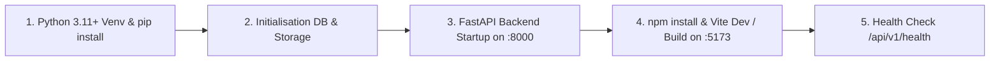

# Deployment & Distribution Guide — SnapCut

## 1. Overview
Ce document formalise les procédures de déploiement, de packaging et d'exécution locale de l'application **SnapCut**.

---

## 2. Infrastructure & Environment Boundaries
* **Architecture Cible :** Monoposte / Local Desktop & Web SPA
* **Backend :** FastAPI / Uvicorn (Port 8000)
* **Frontend :** Vite / React 18+ (Port 5173)
* **Persistance :** Fichier SQLite `snapcut.db` et stockage média `storage/`
* **Orchestration :** Scripts de démarrage en 1 clic (`run_app.bat` pour Windows, `run_app.sh` pour Linux/macOS)

---

## 3. Deployment Steps



---

## 4. Production Build (Frontend SPA)
Pour builder le bundle statique du frontend prêt à être servi par FastAPI ou un serveur Nginx/Caddy :
```bash
cd frontend
npm run build
```
Les fichiers statiques sont compilés dans `frontend/dist/`.

---

## 5. Rollback & Disaster Recovery
* **Sauvegarde de la base locale :** Le fichier `snapcut.db` peut être copié/restauré instantanément.
* **Réinitialisation du stockage temporaire :** La suppression du dossier `storage/temp/` purge les fichiers audio temporaires sans affecter les vidéos exportées dans `storage/exports/`.

---

## 6. Status & Next Step
* **Status :** PASS
* **Next Phase :** 15 — production-verification
