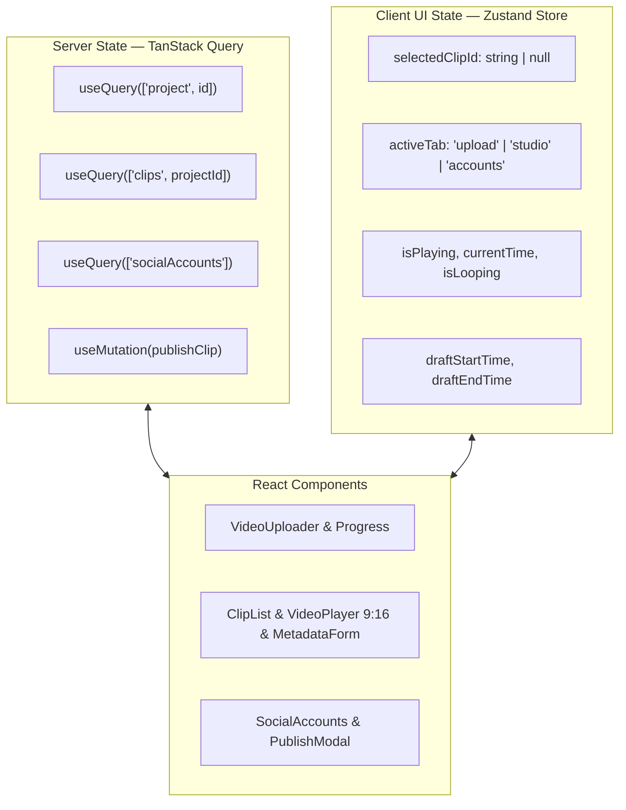

# Frontend Architecture Specification — SnapCut

## 1. Application Structure & File Tree
Le frontend est une Single Page Application React 18+ bâtie avec Vite et TypeScript strict.

```text
frontend/
├── src/
│   ├── assets/
│   ├── components/
│   │   ├── layout/
│   │   │   ├── Header.tsx
│   │   │   └── TabNav.tsx
│   │   ├── dashboard/
│   │   │   ├── VideoUploader.tsx
│   │   │   ├── ProcessingSettings.tsx
│   │   │   └── ProcessingProgress.tsx
│   │   ├── studio/
│   │   │   ├── ClipList.tsx
│   │   │   ├── ClipCard.tsx
│   │   │   ├── VideoPlayer.tsx
│   │   │   ├── TimelineAdjuster.tsx
│   │   │   └── ClipMetadataForm.tsx
│   │   └── social/
│   │       ├── SocialAccounts.tsx
│   │       ├── AccountCard.tsx
│   │       └── PublishModal.tsx
│   ├── hooks/
│   │   ├── useProject.ts
│   │   ├── useClips.ts
│   │   └── useSocial.ts
│   ├── stores/
│   │   └── useStudioStore.ts (Zustand)
│   ├── services/
│   │   └── api.ts (Typed Axios client)
│   ├── types/
│   │   └── index.ts
│   ├── App.tsx
│   ├── index.css
│   └── main.tsx
├── package.json
├── tailwind.config.js
├── tsconfig.json
└── vite.config.ts
```

---

## 2. State Management Architecture



* **Server State (TanStack Query) :**
  - Gestion du cache, synchronisation automatique et polling intelligent (intervalle de 1.5s pendant la découpe `PROCESSING`).
  - Invalidation atomique lors des mutations (ex: modification d'un clip ou déconnexion d'un compte social).
* **Client UI State (Zustand - `useStudioStore`) :**
  - Clip actuellement visualisé dans le lecteur 9:16.
  - État de lecture vidéo (temps courant, volume, lecture en boucle).
  - Timecodes temporaires lors de l'ajustement fin sur la timeline.

---

## 3. API Communication Layer (`src/services/api.ts`)
* Axios configuré avec `baseURL = http://localhost:8000/api/v1`.
* Fonctions typées d'accès aux données :
  - `uploadVideo(file, onProgress)`
  - `startProcessing(projectId, options)`
  - `getProject(projectId)`
  - `updateClip(clipId, data)`
  - `getSocialAccounts()`
  - `getOAuthAuthorizeUrl(platform)`
  - `publishClip(clipId, platforms, customMetadata)`
  - `getPublishJob(jobId)`

---

## 4. Video Player & 9:16 Studio Engine
* Composant `VideoPlayer.tsx` avec balise native HTML5 `<video>` encapsulée dans un conteneur rigide `aspect-[9/16]`.
* Support du scrubbing temps réel, raccourcis clavier (Espace pour Play/Pause, flèches directionnelles), lecture en boucle par défaut (`loop=true`).
* Écoute de l'événement `timeupdate` pour synchroniser le curseur de timeline.

---

## 5. Status & Next Step
* **Status :** PASS (All Architecture & Design gates completed)
* **Next Phase :** 11 — implementation
