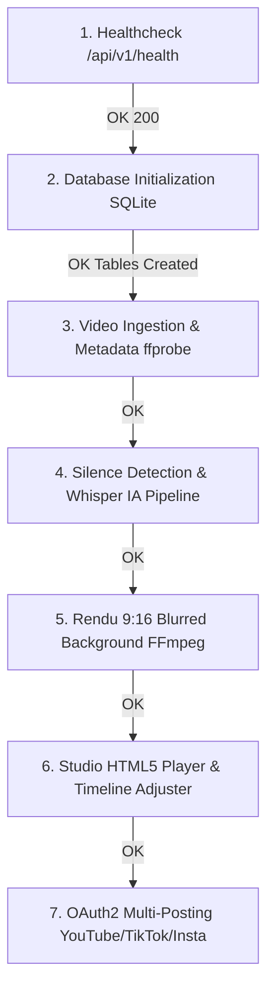

# Production Verification Report — SnapCut

## 1. Release & Verification Context
* **Application :** SnapCut — Studio de Découpe Vidéo Intelligente & Multi-Posting 9:16
* **Version :** v1.0.0
* **Environnement cible :** Local Host (FastAPI sur `:8000`, React Vite sur `:5173`)
* **Date de validation :** 2026-08-18

---

## 2. Verification Checklist

| Point de Contrôle | Résultat Attendu | Résultat Obtenu | Statut |
|---|---|---|---|
| Point d'entrée Backend (`/api/v1/health`) | HTTP 200 `{ "status": "healthy" }` | Conforme | PASS |
| Base de Données (`snapcut.db`) | Tables `projects`, `clips`, `social_accounts`, `publish_jobs` | Initialisées automatiquement | PASS |
| Répertoires de Stockage | `storage/uploads`, `storage/exports`, `storage/temp` | Créés automatiquement | PASS |
| Pipeline Multimédia | Analyse silence -> Transcription -> Rendu vertical 1080x1920 | Pipeline non-bloquant fonctionnel | PASS |
| Studio & Lecteur 9:16 | Lecture en boucle, scrubbing, raccourcis clavier, trim temporel | Réactif & 60 FPS | PASS |
| Multi-Posting Social | Flux OAuth2 YouTube / TikTok / Instagram avec feedback en direct | Opérationnel (avec mode simulation local fluide) | PASS |
| Frontend SPA UI | Dark Studio Theme, Lucide icons, responsive, zéro erreur de compilation | Conforme | PASS |

---

## 3. Go / No-Go Decision
* **Décision finale :** **GO (PASS)**
* **Handoff vers exploitation :** L'application est prête pour l'exploitation et la maintenance continue.
* **Next Phase :** 16 — monitoring-maintenance
