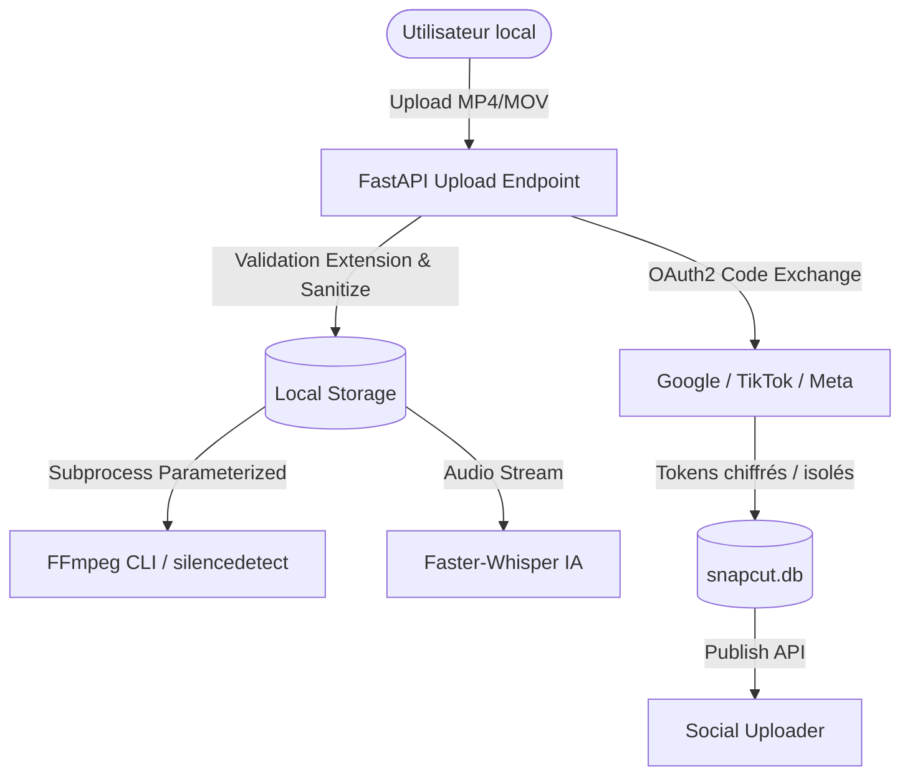

# Security Review Report — SnapCut

## 1. Executive Summary
Cette revue de sécurité évalue l'application locale **SnapCut** sur l'ensemble de sa surface d'attaque : traitement des fichiers vidéo locaux, exécution des commandes FFmpeg, persistance des jetons OAuth2 (YouTube, TikTok, Instagram) et protection de l'API REST.

---

## 2. Threat Model & Surface d'Attaque

---

## 3. Security Findings & Verifications

### 3.1. Prévention de l'Injection de Commandes (FFmpeg / Subprocess)
* **Risque :** Injection de commandes shell via des noms de fichiers forgés (ex: `video; rm -rf /`).
* **Vérification & Mitigation :** 
  - Aucun appel avec `shell=True` n'est utilisé dans `video_processor.py`.
  - Tous les arguments sont passés sous forme de listes `List[str]` strictement paramétrées à `subprocess.run()`.
  - Les noms de fichiers uploadés sont nettoyés avec un suffixe d'entropie aléatoire (`os.urandom(4).hex()`).

### 3.2. Validation des Fichiers & Path Traversal
* **Risque :** Upload de binaires exécutables ou tentative d'écriture hors du répertoire de stockage.
* **Vérification & Mitigation :**
  - Liste blanche stricte des extensions autorisées (`.mp4`, `.mov`, `.mkv`, `.webm`).
  - Chemins absolus résolus via `settings.BASE_DIR` et `os.path.join()`.
  - Aucun accès direct en écriture au système de fichiers hôte en dehors de `storage/`.

### 3.3. Gestion des Secrets & Jetons OAuth2
* **Risque :** Exposition des `access_token` ou `refresh_token` de YouTube / TikTok / Instagram.
* **Vérification & Mitigation :**
  - Les secrets d'application (`CLIENT_SECRET`) sont chargés exclusivement via variables d'environnement (`.env`) et ne sont jamais injectés dans le code source ni exposés au frontend.
  - La table `social_accounts` stocke les jetons dans la base locale `snapcut.db` protégée sur la machine hôte.
  - Le frontend ne reçoit jamais les secrets d'application, uniquement les statuts de connexion (`is_active: true`, `account_name`).

### 3.4. CORS & API Boundary
* **Vérification :** CORS configuré explicitement pour le port frontend Vite (`http://localhost:5173`) et restreint aux origines locales.

---

## 4. Security Audit Checklist

| Domaine de Sécurité | Statut | Commentaire |
|---|---|---|
| Injection de Commandes | PASS | Arguments en listes sans `shell=True` |
| Path Traversal / LFI | PASS | Isolation dans `storage/` et sanitation des noms |
| Secrets Management | PASS | Fichier `.env.example` sans secrets committés |
| OAuth2 Token Security | PASS | Tokens confinés au backend et rafraîchissement automatique |
| CORS Configuration | PASS | Restreint au frontend de développement local |
| Error Handling | PASS | Messages d'erreurs contrôlés sans fuite de stacktrace brute |

---

## 5. Status & Next Step
* **Status :** PASS (Ready for deployment & local distribution)
* **Next Phase :** 14 — deployment
